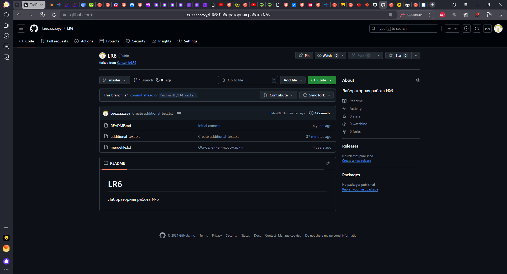
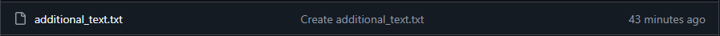
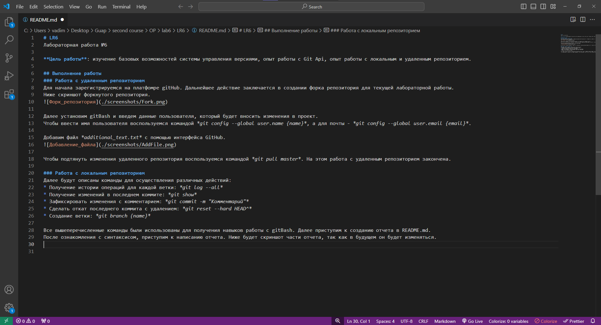

# LR6
Лабораторная работа №6

**Цель работы**: изучение базовых возможностей системы управления версиями, опыт работы с Git Api, опыт работы с локальным и удаленным репозиторием.

## Выполнение работы
### Работа с удаленным репозиторием
Для начала зарегистрируемся на платфомре gitHub. Дальнейшее действие заключается в создании форка репозитория для текущей лабораторной работы.
Ниже скриншот форкнутого репозитория.

Далее установим gitBash и введем данные пользователя, который будет вносить изменения в проект. 
Чтобы ввести имя пользователя воспользуемся командой *git config --global user.name {name}*, а для почты - *git config --global user.email {email}*.

Добавим файл *additional_text.txt* с помощью интерфейса GitHub.

Чтобы подтянуть изменения удаленного репозитория воспользуемся командой *git pull master*. На этом работа с удаленным репозиторием закончена.

### Работа с локальным репозиторием
Далее будут описаны команды для осуществления различных действий:
* Получение истории операций для каждой ветки: *git log --all*
* Получение изменений в последнем коммите: *git show*
* Зафиксировать изменения с комментарием: *git commit -m "Комментарий"*
* Сделать откат последнего коммита с удалением: *git reset --hard HEAD^*
* Создание ветки: *git branch {name}*

Все вышеперечисленные команды были использованы для получения навыков работы с gitBash. Далее приступим к созданию отчета в README.md.
После ознакомления с синтаксисом, приступим к написанию отчета. Ниже будет скриншот части отчета, так как в будущем он будет изменяться.

Применим команду *git log --pretty=format:"%h - %ad - %an - %s" --date=short* для получения форматированных изменений. Результат ниже:
2c674d3 - 2024-10-04 - 4318 Byrsan Vadim Andreevich - Внесение изменений в отчет: добавление работы с локальным репозиторием
7a06c46 - 2024-10-04 - 4318 Byrsan Vadim Andreevich - Добавлена новая часть отчета, посвященная работе с удаленным репозиторием
1237cda - 2024-10-04 - 4318 Byrsan Vadim Andreevich - Внесены изменения в readme: Добавлена цель лабораторной работы
d9a6d90 - 2024-10-04 - 4318 Byrsan Vadim Andreevich - Вносим изменения
3f4a788 - 2024-10-04 - Leezzzzzzyy - Create additional_text.txt
921f53b - 2020-11-21 - Kurtyanik - Обновление информации
c08a654 - 2020-11-21 - Kurtyanik - Файл создан пустым
3c6e913 - 2020-11-21 - Kurtyanik - Initial commit
